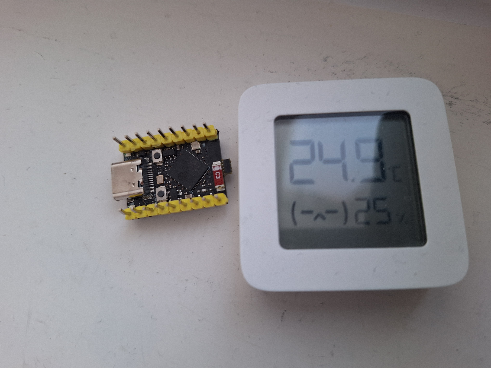

# MijaESP32Hub (ESP32‑S3 BLE Hub)



ESP32‑S3 BLE hub that scans BLE advertisements, parses sensor data, and exposes everything via a web UI and HTTP API. The system can be extended with ESP32‑C3 satellites that scan BLE and forward data to the hub.

## System Overview (Hub + Satellites)
- **Hub (ESP32‑S3)**: primary scanner + web UI + HTTP API + PWA
- **Satellites (ESP32‑C3)**: extra scanners that forward BLE data to the hub
- **Discovery**: hub broadcasts its IP; satellites auto‑connect

### Data Flow
1. Hub broadcasts `SATMASTER <IP> <port>` over UDP port 19798.
2. Satellite listens and sets the target URL to `http://<IP>:<port>/api/satellite-data`.
3. Satellite scans BLE and POSTs **one JSON object** per advertisement.
4. Hub merges local + satellite data and serves it in UI/API.

## Supported Devices & Firmware (tested)
- **Xiaomi/Mijia LYWSD03MMC**
  - **pvvx custom firmware** (Service Data UUID 0x181A)
  - **ATC custom firmware** (Service Data UUID 0x181A)
  - **BTHome v2** (UUID 0xFCD2, e.g., pvvx firmware)
- **Xiaomi MiBeacon** (Manufacturer Data UUID 0xFE95)

> If a device emits 0x181A service data or MiBeacon payloads, it is likely compatible.

## Hardware
### Hub
- **Board**: ESP32‑S3‑DevKitC‑1
- **Chip**: ESP32‑S3 (dual‑core, Wi‑Fi + BLE)
- **Flash**: 8MB (typ.)
- **USB**: Native USB‑Serial/JTAG

### Satellite
- **Board**: ESP32‑C3‑DevKitM‑1
- **Chip**: ESP32‑C3 (RISC‑V, Wi‑Fi + BLE)
- **Flash**: 2MB (typ.)

## Features
- **BLE scanning** (local + satellites)
- **Data parsing** (pvvx / ATC / MiBeacon / BTHome v2)
- **Web UI** (dashboard + settings)
- **PWA** (add to home screen; no caching)
- **HTTP API** (device data + satellite uplink)
- **UDP discovery** (satellites auto‑find hub)

## API
- `GET /api/devices` – list devices with latest data
- `POST /api/satellite-data` – satellite uplink (single JSON object)
  - **Required**: `mac`, `rssi`, `data`
  - **Optional**: `name`, `type`, `temp`, `hum`, `bat`, `bat_mv`

## Satellite
Satellite repo: https://github.com/juhku1/MijaESP32Satellite

### Satellite Capabilities
- Active BLE scan (includes adv name when available)
- Auto‑discovers hub via UDP broadcast
- HTTP POST to hub `/api/satellite-data`

### Satellite Setup (short)
1. Set Wi‑Fi credentials in satellite firmware.
2. (Optional) set fallback hub URL.
3. Flash ESP32‑C3 and power it up.

## Build & Flash
### Prerequisites
```bash
pip install platformio
```

### Build (Hub)
```bash
platformio run --environment esp32-s3-devkitc-1
```

### Upload (Hub)
```bash
platformio run --target upload --environment esp32-s3-devkitc-1 --upload-port /dev/ttyACM0
```

### Monitor
```bash
platformio device monitor -p /dev/ttyACM0 -b 115200
```

## Configuration
Wi‑Fi credentials are configured at compile time in the source code:
```c
#define WIFI_SSID "YourSSID"
#define WIFI_PASSWORD "YourPassword"
```

---

## Tiivistelmä (FI)
ESP32‑S3 hubi skannaa BLE‑mainoksia, parsii mittaridatan ja näyttää sen web‑UI:ssa. ESP32‑C3‑satelliitit laajentavat peittoa ja forwardaavat datan hubille. Hubi broadcastaa `SATMASTER <IP> <port>` UDP:llä, satelliitit löytävät sen automaattisesti ja lähettävät **yksittäisen JSON‑objektin** per havainto `/api/satellite-data`‑endpointtiin. Tuetut mittarit: Mijia LYWSD03MMC (pvvx/ATC/BTHome v2) sekä Xiaomi MiBeacon‑payloadit.
